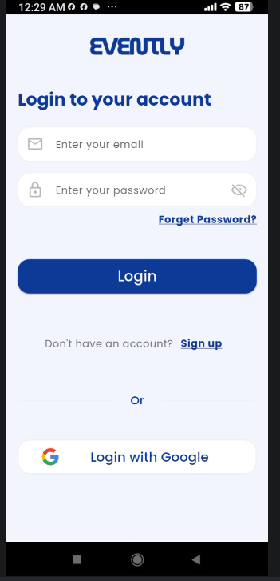
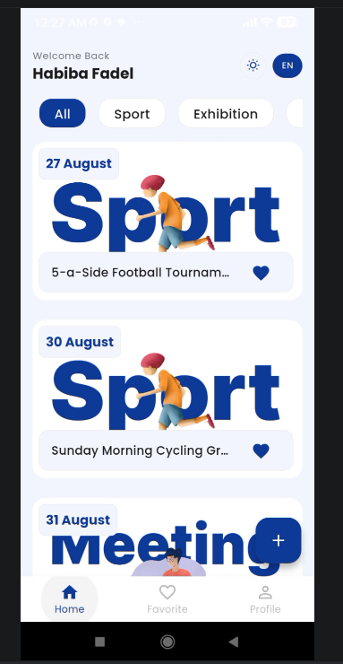
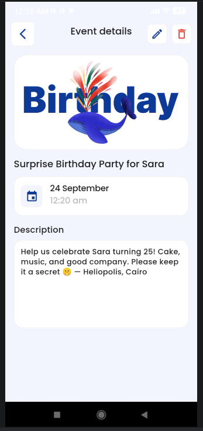
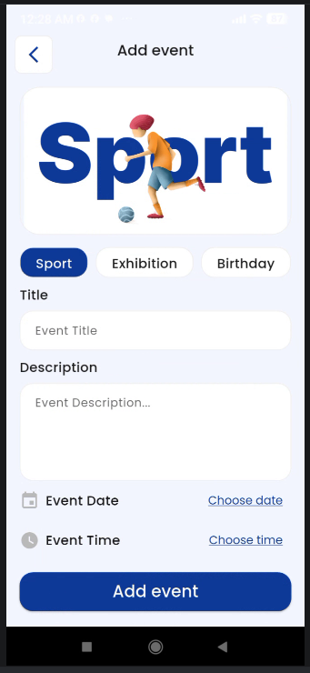

# Evently

**Evently** is a cross-platform event management app built with Flutter, designed to make
discovering, creating, and managing events simple and intuitive — with full support for both Arabic
and English.

> 🚧 **Status:** Actively in development — new features and improvements are being added regularly.

<!-- Add a banner image or GIF of the app here -->
<!--  -->

## ✨ Features

- 🔐 **Authentication** — Secure sign-up/login with Firebase Auth (including Google Sign-In), with
  proper error handling for all Firebase auth error codes
- 🏠 **Home & Discovery** — Browse and explore events on a clean, organized home screen
- ➕ **Create & Edit Events** — Add new events or edit existing ones through a unified event form
- 📄 **Event Details** — View full event information in a dedicated details screen
- ❤️ **Favourites** — Save and manage favourite events for quick access
- 👤 **Profile** — View and manage user profile information
- 🌍 **Localization** — Full Arabic and English language support via Easy Localization
- 🎨 **Theming** — Light/dark mode support with a centralized app theme
- ☁️ **Cloud-Backed** — Real-time data storage and sync with Firebase/Firestore
- 🧭 **Onboarding** — Guided intro and personalization flow for first-time users

## 🛠️ Built With

- **[Flutter](https://flutter.dev/)** — Cross-platform UI framework
- **[Firebase](https://firebase.google.com/)** — Authentication & Firestore database
- **[Provider](https://pub.dev/packages/provider)** — State management
- **[Easy Localization](https://pub.dev/packages/easy_localization)** — Arabic/English localization

## 📁 Project Structure

```
lib/
├── generated/          # Auto-generated files (localization, etc.)
├── models/             # Data models
├── providers/           # State management (Provider)
├── ui/
│   ├── home/
│   │   ├── event_screens/
│   │   │   └── add_event/   # Add/edit event screens
│   │   ├── tabs/
│   │   │   ├── favourite/   # Favourites tab
│   │   │   └── profile/     # Profile tab
│   │   └── widgets/         # Shared home widgets (e.g., EventCard)
│   ├── intro/           # Onboarding & personalization screens
│   └── login/
│       └── widgets/      # Login/auth screens & widgets
└── utils/               # Helpers, constants, and utilities
```

## 🚀 Getting Started

### Prerequisites

- [Flutter SDK](https://docs.flutter.dev/get-started/install) installed
- A Firebase project set up (Authentication + Firestore enabled)

### Installation

1. Clone the repository
   ```bash
   git clone https://github.com/Habi-ba/Evently_App.git
   cd Evently_App
   ```

2. Install dependencies
   ```bash
   flutter pub get
   ```

3. Set up Firebase
   - Add your `google-services.json` (Android) to `android/app/`
   - Add your `GoogleService-Info.plist` (iOS) to `ios/Runner/`

4. Run the app
   ```bash
   flutter run
   ```

## 📱 Screenshots

| Login                           | Home                               | Event Details                                  | Add Event                              |
|---------------------------------|------------------------------------|------------------------------------------------|----------------------------------------|
|  |  |  |  |

## 🤝 Contributing

Contributions, issues, and feature requests are welcome. Feel free to check
the [issues page](https://github.com/Habi-ba/Evently_App/issues).

## 👩‍💻 Author

**Habiba**

- GitHub: [@Habi-ba](https://github.com/Habi-ba)